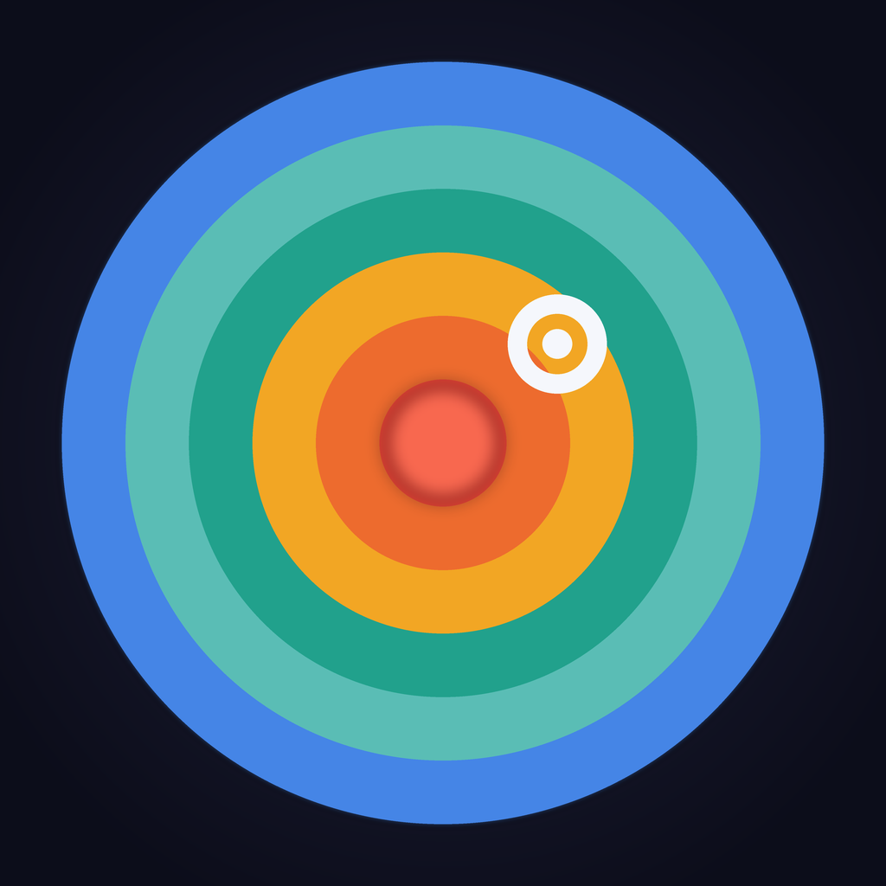
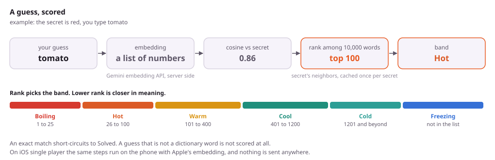
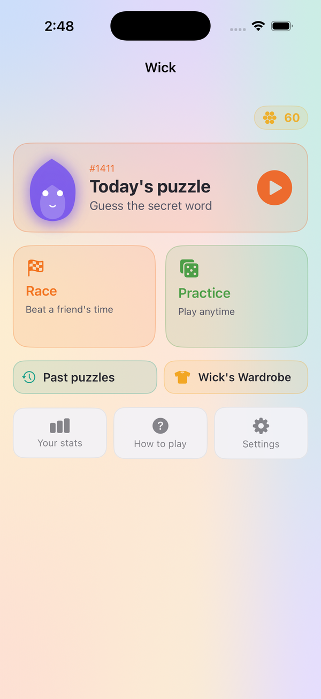
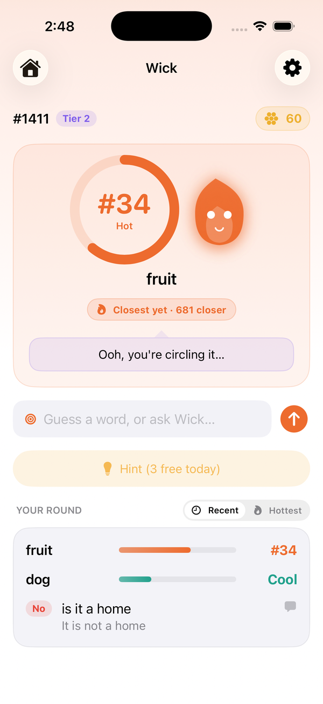
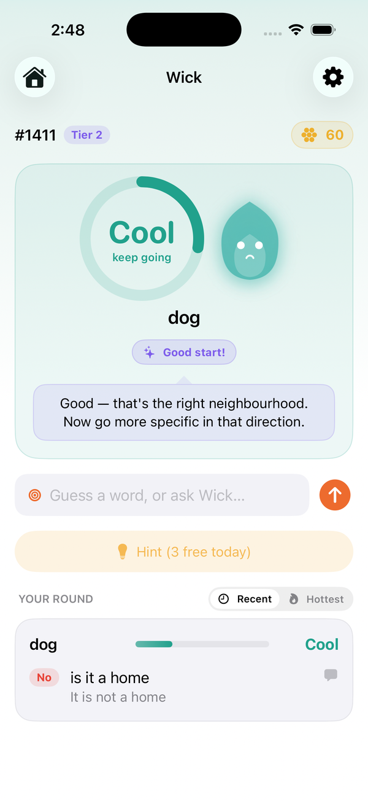
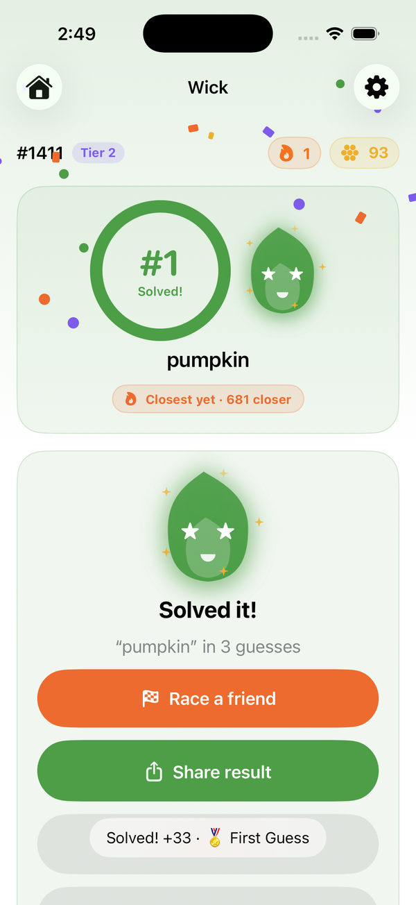
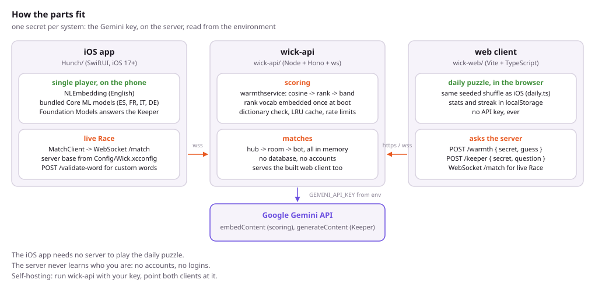
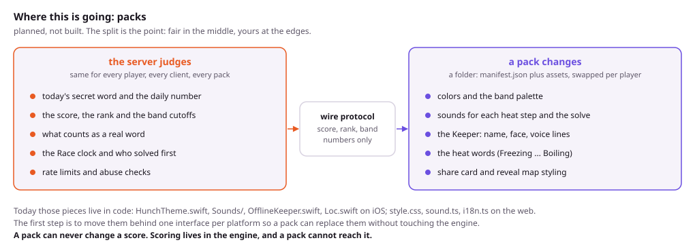

<p align="center">
  
</p>

<h1 align="center">Wick</h1>

<p align="center"><b>A daily word game where you guess by meaning, not spelling.</b></p>

<p align="center">
  <a href="LICENSE"></a>
  
  
  
  
  
</p>

<p align="center">
  <a href="https://guesswick.com">Play in your browser</a> ·
  <a href="https://apps.apple.com/app/id6777743483">App Store</a> ·
  <a href="https://guesswick.com/marketing/">Website</a> ·
  <a href="https://guesswick.com/marketing/privacy.html">Privacy</a> ·
  <a href="https://github.com/jasonepage/Wick/issues">Report a bug</a>
</p>

---

There is one secret word a day. Type any word and Wick tells you how close
you are in meaning: freezing, cold, cool, warm, hot, boiling. "Tomato" is hot
when the answer is "red". "Tomb" is freezing, even though the letters look
close. No letter clues, no colored tiles. You can also ask Wick, the little
flame who guards the word, yes or no questions, and it answers without ever
giving the word away.

The iOS app and the web game play the same daily puzzle, in English, Spanish,
French, Italian and German. Single player on iOS runs entirely on the phone.
Live races and the web game are scored by a small server, and that server is
the only place a secret lives: one Google Gemini API key, read from its
environment. This repository is all three parts.

<p align="center">
  <picture>
    <source media="(prefers-color-scheme: dark)" srcset="docs/diagrams/scoring-dark.svg">
    
  </picture>
</p>

## Status, plainly

| | |
|---|---|
| Stage | Live. Version 3.3 on the [App Store](https://apps.apple.com/app/id6777743483) and at [guesswick.com](https://guesswick.com). |
| Team | One developer. No company, no funding. |
| Platforms | iPhone, iOS 17 and later. Any modern browser. No Android app; the web game is the Android answer. |
| Server | One Node process on Render, in memory, no database. Self-hostable with your own Gemini key. |
| Accounts | None. No logins, no tracking, no ads. Single-player stats live on your device. |
| Price | Free. Optional coin packs on iOS for extra hints. |
| Dependencies | Server: Hono, ws, word-list. Web: Vite, qrcode. iOS: Apple frameworks only. |

## What it looks like

<p align="center">
  
  
  
  
</p>

## How it works

1. **Every word becomes an embedding.** An embedding is a long list of
   numbers that describes how a word is used. Words used in similar ways get
   similar numbers. The server gets these from the Gemini embedding API. The
   iOS app gets them from Apple's built-in word embedding for English, and
   from four small Core ML models in this repo for Spanish, French, Italian
   and German.
2. **Closeness is the angle between two embeddings** (cosine similarity).
   A small angle means close in meaning. Raw cosine is never shown, because
   on Gemini's model even unrelated words sit around 0.8.
3. **The score is a rank.** The server embeds a vocabulary of 9,850 common
   words once, sorts them by closeness to today's secret, and reports where
   your guess lands. Rank 1 is the answer and rank 2 is the single closest
   word. Boiling is rank 25 or better, hot is 100, warm is 400, cool is 1200,
   cold is everything after that. The iOS app uses the same cutoffs
   (`HunchTheme.swift`), so a live race and a solo round feel the same.
4. **Only real words are scored.** The server checks a 274,000 word
   dictionary first; a typo is bounced, not scored.
5. **The daily word is a seeded shuffle.** `DailyWords.swift` on iOS and
   `dailyPool.json` on the web hold the same pool, and the day number picks
   the word, so every device agrees on the puzzle without asking anyone.
6. **The Keeper answers yes or no.** Each secret word carries a few hand
   written facts (`WordAttributes.swift`). Questions those facts can answer
   are answered by rule, never by a model, so the Keeper cannot contradict
   them. Everything else goes to Apple's on-device Foundation Models on iOS
   26, or to Gemini on the web, and the secret is scrubbed from the reply.

<p align="center">
  <picture>
    <source media="(prefers-color-scheme: dark)" srcset="docs/diagrams/architecture-dark.svg">
    
  </picture>
</p>

## The server, route by route

Everything below is in `wick-api/src/server.ts`. The scoring, Keeper and
match routes are rate limited per IP address. There is no state between
requests except the in-memory match rooms and the embedding cache.

| Route | Body | Returns | What it is for |
|---|---|---|---|
| `POST /warmth` | `{ secret, guess }` | `{ score, rank, source }` | Score one guess. `source` is `rank`, `embeddings`, `exact` or `fallback` (no key). |
| `POST /keeper` | `{ secret, question }` | `{ verdict, reply, source }` | Ask the Keeper. The reply is scrubbed of the secret before it leaves. |
| `POST /validate-word` | `{ word }` | `{ ok, verdict }` | May this word be a Race secret? Checks the dictionary and that it embeds cleanly. |
| `POST /reveal` | `{ guesses: [{ word, score }] }` | `{ points }` | The reveal map: a 2D layout of your guesses around the answer. Only words you sent come back. |
| `POST /event` | `{ name, ... }` | `{ ok }` | A short allowlist of product events. Ids are hashed on arrival. |
| `WS /match?kid=` | frames in `protocol.ts` | frames | Live Race. Up: `queue`, `guess`, `question`, `heartbeat`. Down: `paired`, `state`, `scored`, `result`. |
| `GET /p/:code`, `/r/:run`, `/d/:code` | | HTML | Share links. An installed app opens them via Universal Links; a browser gets a preview page that bounces into the web game. No link ever carries a word. |
| `GET /healthz` | | JSON | Readiness, including whether the rank vocabulary has finished embedding. |

The web client imports its wire types straight from `wick-api/src/protocol.ts`
through a TypeScript path alias, so the two cannot drift.

## Where this is going

The next big change is to split what the server decides from what the
player sees, the way osu! separates the game's judgement from skins. The
server stays the one judge: the secret, the score, the bands, the clock and
the dictionary are the same for every player on every client. Everything
cosmetic becomes a **pack**: a folder with a `manifest.json` and assets that
a player can swap. Colors, the sounds for each heat step, the Keeper's name
and face and lines, the heat words themselves, the share card. A pack cannot
change a score, because the scoring engine never reads from one.

<p align="center">
  <picture>
    <source media="(prefers-color-scheme: dark)" srcset="docs/diagrams/packs-dark.svg">
    
  </picture>
</p>

None of this is built. Today those pieces live in code: `HunchTheme.swift`,
`Sounds/`, `OfflineKeeper.swift` and `Loc.swift` on iOS; `style.css`,
`sound.ts` and `i18n.ts` on the web. The first step is one interface per
platform that the engine talks to, so a pack can replace the defaults without
touching anything that scores. If you want to help, that is the place.

## Where things are

| Path | What |
|---|---|
| `Hunch/Engine/` | Scoring (`SemanticEngine.swift`), the daily word pool, the Keeper (`QuestionService.swift`, `OfflineKeeper.swift`, `WordAttributes.swift`), word lists per language |
| `Hunch/Live/` | The live Race client: `LiveConfig.swift`, `MatchClient.swift`, the wire protocol |
| `Hunch/Game/`, `Hunch/Views/`, `Hunch/Theme/` | SwiftUI. `GameViewModel.swift` is the round |
| `Config/` | `Wick.xcconfig` (committed defaults), `Local.xcconfig.example`, the merged `Info.plist` |
| `ODRResources/` | Core ML embedding models for Spanish, French, Italian and German, loaded on demand |
| `wick-api/src/` | `server.ts` routes, `warmthservice.ts` scoring, `embeddings.ts` Gemini, `hub.ts` and `room.ts` matches, `bot.ts` the practice opponent |
| `wick-web/src/` | `main.ts` the app, `game/daily.ts` the seeded daily, `net/` the client |
| `debug/` | The embedding build pipeline (`embeddings/`), a load tester, a Python port of the Keeper's rule table |
| `docs/` | The GitHub Pages site, diagrams, screenshots, and `wick/CROSS_PLATFORM.md` |

## Building

### Web and server

Node 22.9 or newer and a Gemini API key. The web client has no key of its
own; it talks to `wick-api`, and the key lives only there.

```bash
cd wick-api
npm ci
cp .env.example .env        # put your key in GEMINI_API_KEY
npm run dev                 # http://localhost:8080

cd ../wick-web              # second terminal
npm ci
npm run dev                 # http://localhost:5173, talks to localhost:8080
```

To serve the game from one process the way guesswick.com does:

```bash
cd wick-api && npm run build:all && npm start
```

`render.yaml` is an optional Render Blueprint for that layout. Every server
variable is documented in `wick-api/.env.example`. `WICK_ALLOWED_ORIGINS`
must include your own domain for the browser's live socket to connect, and
`WICK_DEBUG_TOKEN` should stay unset in production: the debug routes reveal
the secret word.

### iOS

Xcode 26 or newer. The app targets iOS 17; the Keeper's on-device model needs
iOS 26 and an Apple Intelligence capable device, and falls back to rule based
answers below that.

```bash
cp Config/Local.xcconfig.example Config/Local.xcconfig
open Hunch.xcodeproj
```

Set `DEVELOPMENT_TEAM` and a `PRODUCT_BUNDLE_IDENTIFIER` you own in
`Local.xcconfig` (it is gitignored), and `WICK_SERVER_BASE` if you want live
Race against your own server. Write URLs as `wss:/$()/host`, because `//`
starts a comment in an xcconfig file. Single player works with no server and
no key. iCloud sync and Game Center need their capabilities on your App ID;
without them those calls fail quietly and the game still plays.

### Bring your own Gemini key

1. Create a key at https://aistudio.google.com/apikey and restrict it to the
   Generative Language API.
2. Locally, put it in `wick-api/.env`. On a host, set `GEMINI_API_KEY` in the
   environment settings instead of a file.
3. Without a key the server still runs: warmth falls back to a rough
   spelling based score, marked `source: "fallback"`, and the Keeper is off.

The key is sent to Google as a query parameter on each call, which is
Google's documented pattern for this API.

## Contributing

Pull requests are welcome for bugs, tests, languages and documentation.
`npm test` in `wick-api` runs 196 tests and should stay green. Keep new
Swift and TypeScript files under the MPL notice, and do not add a server
dependency without a reason: there are four, and that is on purpose.

A bug that lets someone learn the secret word without guessing it is worth
an issue marked `security` before anything else.

## License

[Mozilla Public License 2.0](LICENSE). File level copyleft: you may read,
run and fork this, and build something larger around it under whatever terms
you like, but changes to Wick's own files have to be published under the
same license.

MPL rather than GPL on purpose: GPL family licenses conflict with the App
Store's terms, and a game that cannot ship on the App Store is not a game.

The four bundled embedding models are derived from fastText vectors and keep
their own license; see [THIRD_PARTY_NOTICES.md](THIRD_PARTY_NOTICES.md). The
Wick name, the flame character and the App Store listing are not covered by
the code license.
